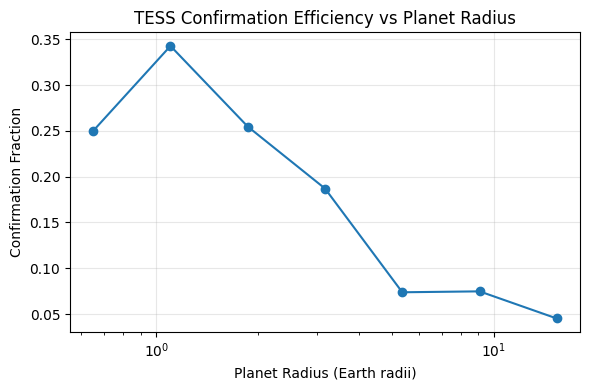
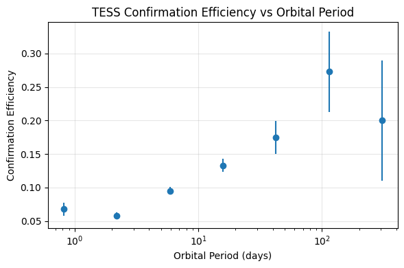
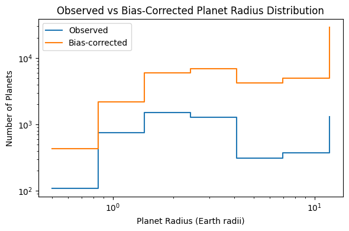
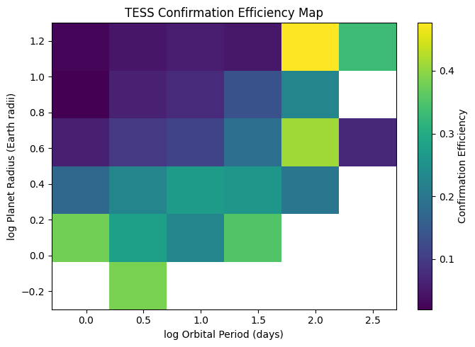
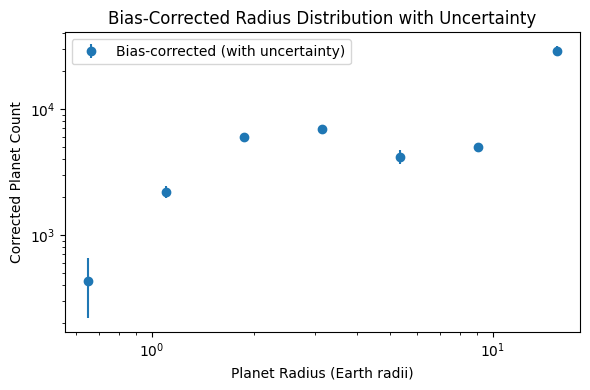

# Quantifying Detection Biases in the TESS Exoplanet Survey

## Overview
Transit surveys such as **TESS** do not provide an unbiased view of the underlying
exoplanet population. Detection and confirmation probabilities depend strongly on
planet radius, orbital period, and limitations in follow-up observations.

This project presents a **reproducible statistical analysis of selection effects**
in the TESS exoplanet survey by comparing detected planet candidates with confirmed
planets and quantifying confirmation efficiency across parameter space.

The goal is to understand **which types of planets TESS preferentially confirms**
and how the observed population differs from the true underlying distribution.

---

## Data Sources
- **NASA Exoplanet Archive** (confirmed exoplanets)
- **TESS Objects of Interest (TOI)** catalog
- TESS Input Catalog (via Exoplanet Archive)

Raw catalog data are **not stored in the repository** and are accessed dynamically
to ensure full reproducibility.

---

## Key Figures

### 1) TESS Candidates vs Confirmed Planets
Comparison of detected planet candidates and confirmed planets in
period–radius space, illustrating strong confirmation bias.

---

### 2) Confirmation Efficiency vs Planet Radius
Confirmation efficiency as a function of planet radius, highlighting reduced
efficiency for small and very large planets.

---

### 3) Confirmation Efficiency vs Orbital Period
Efficiency as a function of orbital period, reflecting false-positive rates at
short periods and limited transit sampling at long periods.

---

### 4) Observed vs Bias-Corrected Planet Radius Distribution
Bias correction reveals a substantially enhanced population of small planets
relative to the confirmed sample.

---

### 5) Two-Dimensional Confirmation Efficiency Map
A two-dimensional map of confirmation efficiency in period–radius space.
Sparse regions are conservatively masked to avoid over-interpretation.

---

## Supporting Analysis

### Bias-Corrected Radius Distribution with Uncertainty
Propagation of binomial uncertainties into the bias-corrected planet counts,
demonstrating increased variance in regions of low confirmation efficiency.

---

## Methodology Summary
1. Ingest confirmed exoplanet and TOI catalogs programmatically
2. Compare confirmed planets and candidates in period–radius space
3. Define confirmation efficiency as the fraction of detected TOIs that are confirmed
4. Quantify efficiency as a function of:
   - Planet radius
   - Orbital period
5. Propagate binomial uncertainties into efficiency estimates
6. Construct a two-dimensional completeness map
7. Correct observed planet populations for confirmation bias

---

---

## Reproducibility
- All figures are generated from notebooks in this repository
- No raw survey data are committed
- Statistical assumptions and limitations are explicitly documented

---

## Scientific Relevance
This project demonstrates survey-level reasoning, statistical rigor, and
bias-aware interpretation of exoplanet catalogs. The methodology is directly
applicable to other transit missions such as **Kepler**, **PLATO**, and **Roman**,
and forms a strong foundation for exoplanet occurrence rate studies.

